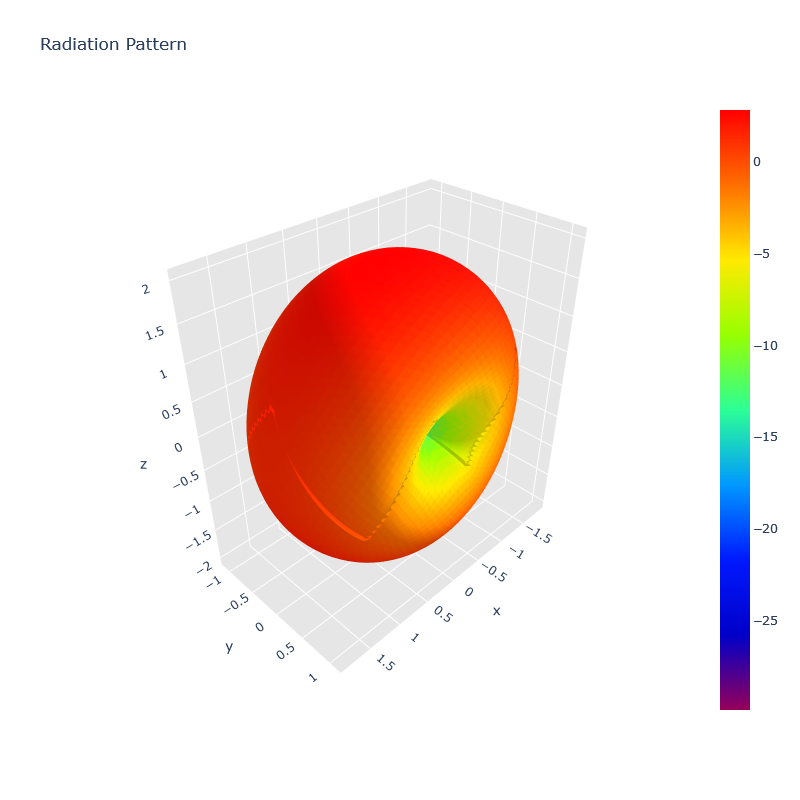
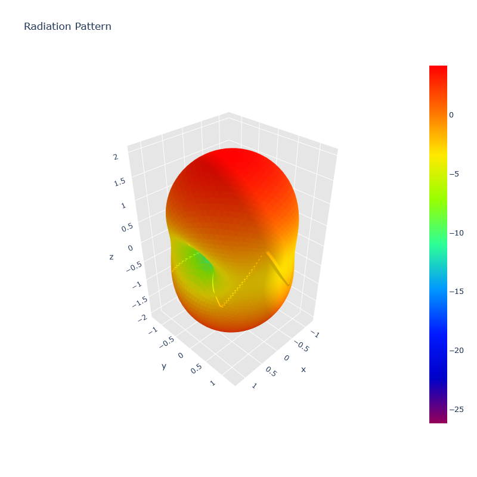

# MoMPython_KN
Try to translate Matlab code from Makarov book into python and then play with antenna designs and analysis.

As the Jupiter notebooks have some dynamic figures, it is suggested to check the notebook with

https://nbviewer.jupyter.org/

______________________________________________________________________________________

* For example, one can copy the link of the RWG_Bowtie notebook and add to viewer to open

https://nbviewer.org/github/Khainguyen1349/MoMPython_KN/blob/main/RWG_Bowtie.ipynb

This is the earliest version of the simulator where one can still find the generation of the antenna mesh, calculation of the RWG basis functions, and the analysis of the antenna performances. Later on, those calculations are placed in libraries [meshlib.py](./meshlib.py) and [rwglib.py](./rwglib.py) for the sake of clarity.
______________________________________________________________________________________

* Simulation of a (Planar) Inverted-F Antenna

https://nbviewer.org/github/Khainguyen1349/MoMPython_KN/blob/main/RWG_IFA.ipynb

A second version with denser mesh is also presented in the project.

______________________________________________________________________________________

* Lumped components analysis on a Dipole antenna @75MHz:

https://nbviewer.org/github/Khainguyen1349/MoMPython_KN/blob/main/RWG_Dipole_75MHz_wLumpedElement.ipynb

______________________________________________________________________________________

* Directivity improvement with lumped components:

https://nbviewer.org/github/Khainguyen1349/MoMPython_KN/blob/main/RWG_Directivity_Optim_withLumped.ipynb

______________________________________________________________________________________

* Simulation for a Yagi antenna functioning at 1Ghz:

https://nbviewer.org/github/Khainguyen1349/MoMPython_KN/blob/main/RWG_Yagi_1GHz.ipynb

______________________________________________________________________________________

* Analysis of Charateristic Modes of a conductive plate:

https://nbviewer.org/github/Khainguyen1349/MoMPython_KN/blob/main/RWG_CharacteristicModes.ipynb

Surface currents of 1st Mode

and its radiation pattern corresponding

Surface currents of 2nd Mode

and its radiation pattern corresponding

The surface currents and radiation pattern associated are very useful for certain types of design, e.g. Capacitive Coupling Element design for mobile terminals, etc. The generalize eigenvalues problem is solved thank to the work of Benyamin Ghojogh.

______________________________________________________________________________________

* Analysis of Quality-Factor of a conductive plate:

https://nbviewer.org/github/Khainguyen1349/MoMPython_KN/blob/main/RWG_QualityFactor_868MHz.ipynb

______________________________________________________________________________________

* I have also tried to simulate a Meta-surface:

https://nbviewer.org/github/Khainguyen1349/MoMPython_KN/blob/main/RWG_Yagi_Reflector_1GHz.ipynb

but, well, I failed! It seems that MoM is not a good method to simulate a large sparse structures :D

Anyway have fun trying to simulate your antenna!
